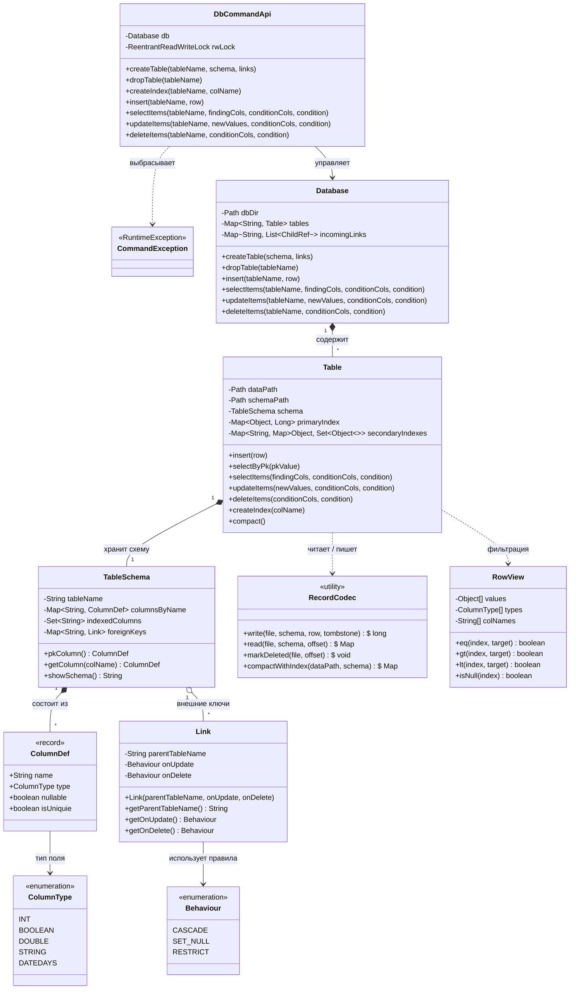

## Диаграмма классов

```mermaid
classDiagram
    class DbCommandApi {
        -Database db
        -ReentrantReadWriteLock rwLock
        +createTable(tableName, schema, links)
        +dropTable(tableName)
        +createIndex(tableName, colName)
        +insert(tableName, row)
        +selectItems(tableName, findingCols, conditionCols, condition)
        +updateItems(tableName, newValues, conditionCols, condition)
        +deleteItems(tableName, conditionCols, condition)
    }

    class CommandException {
        <<RuntimeException>>
    }

    class Database {
        -Path dbDir
        -Map~String, Table~ tables
        -Map~String, List~ChildRef~~ incomingLinks
        +createTable(schema, links)
        +dropTable(tableName)
        +insert(tableName, row)
        +selectItems(tableName, findingCols, conditionCols, condition)
        +updateItems(tableName, newValues, conditionCols, condition)
        +deleteItems(tableName, conditionCols, condition)
    }

    class Table {
        -Path dataPath
        -Path schemaPath
        -TableSchema schema
        -Map~Object, Long~ primaryIndex
        -Map~String, Map~Object, Set~Object~~~ secondaryIndexes
        +insert(row)
        +selectByPk(pkValue)
        +selectItems(findingCols, conditionCols, condition)
        +updateItems(newValues, conditionCols, condition)
        +deleteItems(conditionCols, condition)
        +createIndex(colName)
        +compact()
    }

    class TableSchema {
        -String tableName
        -Map~String, ColumnDef~ columnsByName
        -Set~String~ indexedColumns
        -Map~String, Link~ foreignKeys
        +pkColumn() ColumnDef
        +getColumn(colName) ColumnDef
        +showSchema() String
    }

    class ColumnDef {
        <<record>>
        +String name
        +ColumnType type
        +boolean nullable
        +boolean isUniquie
    }

    class ColumnType {
        <<enumeration>>
        INT
        BOOLEAN
        DOUBLE
        STRING
        DATEDAYS
    }

    class Link {
        -String parentTableName
        -Behaviour onUpdate
        -Behaviour onDelete
        +Link(parentTableName, onUpdate, onDelete)
        +getParentTableName() String
        +getOnUpdate() Behaviour
        +getOnDelete() Behaviour
    }
    class Behaviour {
        <<enumeration>>
        CASCADE
        SET_NULL
        RESTRICT
    }

    Link --> Behaviour : использует правила

    class RecordCodec {
        <<utility>>
        +write(file, schema, row, tombstone)\$ long
        +read(file, schema, offset)\$ Map
        +markDeleted(file, offset)\$ void
        +compactWithIndex(dataPath, schema)\$ Map
    }

    class RowView {
        -Object[] values
        -ColumnType[] types
        -String[] colNames
        +eq(index, target) boolean
        +gt(index, target) boolean
        +lt(index, target) boolean
        +isNull(index) boolean
    }

    DbCommandApi --> Database : управляет
    DbCommandApi ..> CommandException : выбрасывает
    Database "1" *-- "*" Table : содержит
    Table "1" *-- "1" TableSchema : хранит схему
    TableSchema "1" *-- "*" ColumnDef : состоит из
    TableSchema "1" o-- "*" Link : внешние ключи
    ColumnDef --> ColumnType : тип поля
    Table ..> RecordCodec : читает / пишет
    Table ..> RowView : фильтрация
```
